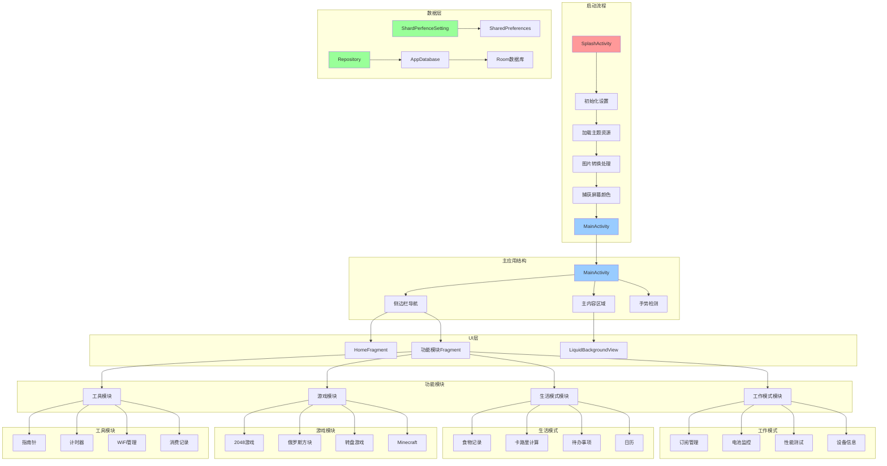
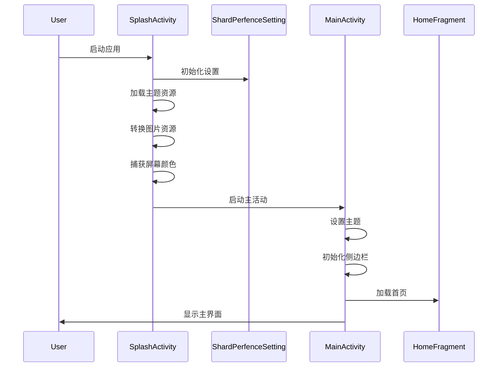
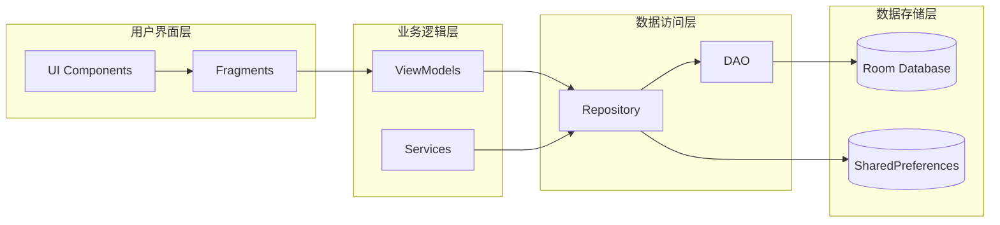
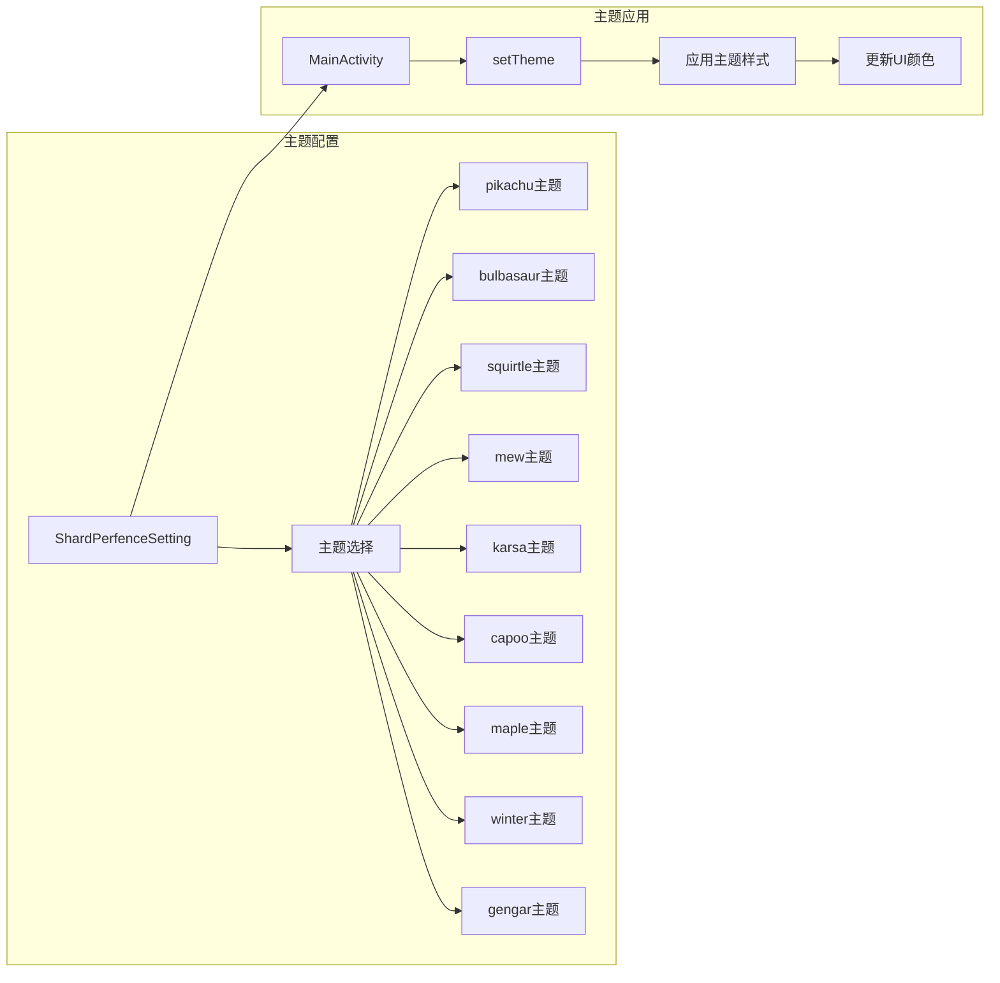
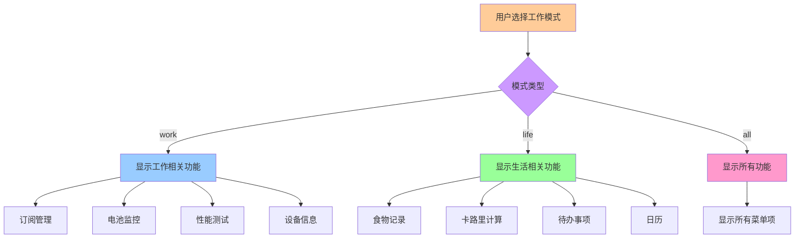
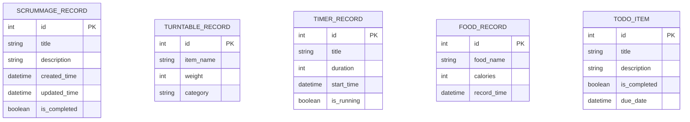
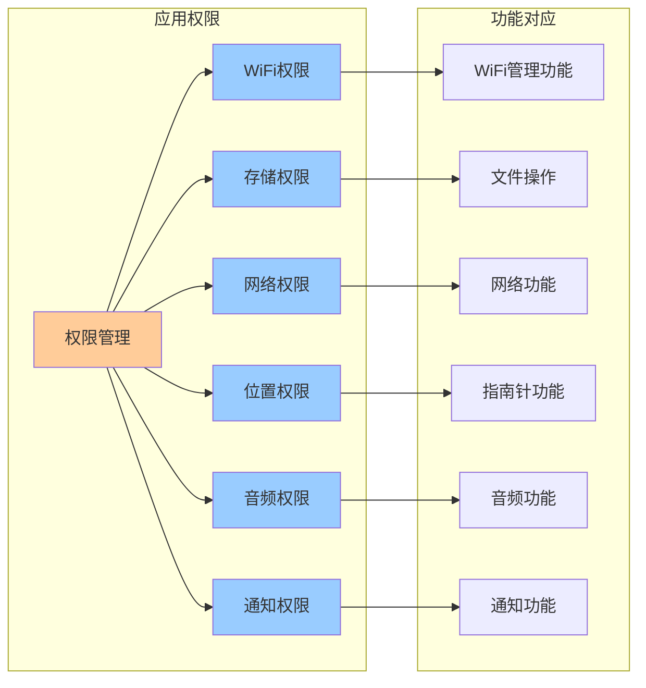

# Zippy应用架构图

## 应用整体架构

```mermaid
graph TB
    subgraph "启动流程"
        A[SplashActivity] --> B[初始化设置]
        B --> C[加载主题资源]
        C --> D[图片转换处理]
        D --> E[捕获屏幕颜色]
        E --> F[MainActivity]
    end

    subgraph "主应用结构"
        F --> G[MainActivity]
        G --> H[侧边栏导航]
        G --> I[主内容区域]
        G --> J[手势检测]
    end

    subgraph "数据层"
        K[ShardPerfenceSetting] --> L[SharedPreferences]
        M[Repository] --> N[AppDatabase]
        N --> O[Room数据库]
    end

    subgraph "UI层"
        H --> P[HomeFragment]
        H --> Q[功能模块Fragment]
        I --> R[LiquidBackgroundView]
    end

    subgraph "功能模块"
        Q --> S[工作模式模块]
        Q --> T[生活模式模块]
        Q --> U[游戏模块]
        Q --> V[工具模块]
    end

    subgraph "工作模式"
        S --> S1[订阅管理]
        S --> S2[电池监控]
        S --> S3[性能测试]
        S --> S4[设备信息]
    end

    subgraph "生活模式"
        T --> T1[食物记录]
        T --> T2[卡路里计算]
        T --> T3[待办事项]
        T --> T4[日历]
    end

    subgraph "游戏模块"
        U --> U1[2048游戏]
        U --> U2[俄罗斯方块]
        U --> U3[转盘游戏]
        U --> U4[Minecraft]
    end

    subgraph "工具模块"
        V --> V1[指南针]
        V --> V2[计时器]
        V --> V3[WiFi管理]
        V --> V4[消费记录]
    end

    style A fill:#ff9999
    style F fill:#99ccff
    style G fill:#99ccff
    style K fill:#99ff99
    style M fill:#99ff99
```

## 应用启动流程

```mermaid
sequenceDiagram
    participant User
    participant SplashActivity
    participant ShardPerfenceSetting
    participant MainActivity
    participant HomeFragment

    User->>SplashActivity: 启动应用
    SplashActivity->>ShardPerfenceSetting: 初始化设置
    SplashActivity->>SplashActivity: 加载主题资源
    SplashActivity->>SplashActivity: 转换图片资源
    SplashActivity->>SplashActivity: 捕获屏幕颜色
    SplashActivity->>MainActivity: 启动主活动
    MainActivity->>MainActivity: 设置主题
    MainActivity->>MainActivity: 初始化侧边栏
    MainActivity->>HomeFragment: 加载首页
    MainActivity->>User: 显示主界面
```

## 数据流架构

```mermaid
flowchart LR
    subgraph "用户界面层"
        UI[UI Components]
        Fragments[Fragments]
    end

    subgraph "业务逻辑层"
        ViewModels[ViewModels]
        Services[Services]
    end

    subgraph "数据访问层"
        Repository[Repository]
        DAO[DAO]
    end

    subgraph "数据存储层"
        RoomDB[(Room Database)]
        SharedPrefs[(SharedPreferences)]
    end

    UI --> Fragments
    Fragments --> ViewModels
    ViewModels --> Repository
    Repository --> DAO
    DAO --> RoomDB
    Repository --> SharedPrefs
    Services --> Repository
```

## 主题系统架构

```mermaid
graph LR
    subgraph "主题配置"
        A[ShardPerfenceSetting] --> B[主题选择]
        B --> C[pikachu主题]
        B --> D[bulbasaur主题]
        B --> E[squirtle主题]
        B --> F[mew主题]
        B --> G[karsa主题]
        B --> H[capoo主题]
        B --> I[maple主题]
        B --> J[winter主题]
        B --> K[gengar主题]
    end

    subgraph "主题应用"
        L[MainActivity] --> M[setTheme]
        M --> N[应用主题样式]
        N --> O[更新UI颜色]
    end

    A --> L
```

## 工作模式过滤逻辑

```mermaid
flowchart TD
    A[用户选择工作模式] --> B{模式类型}
    B -->|work| C[显示工作相关功能]
    B -->|life| D[显示生活相关功能]
    B -->|all| E[显示所有功能]
    
    C --> F[订阅管理]
    C --> G[电池监控]
    C --> H[性能测试]
    C --> I[设备信息]
    
    D --> J[食物记录]
    D --> K[卡路里计算]
    D --> L[待办事项]
    D --> M[日历]
    
    E --> N[显示所有菜单项]
    
    style A fill:#ffcc99
    style B fill:#cc99ff
    style C fill:#99ccff
    style D fill:#99ff99
    style E fill:#ff99cc
```

## 功能模块详细结构

```mermaid
graph TB
    subgraph "核心功能"
        Core[核心功能]
        Core --> Home[首页]
        Core --> Settings[设置]
        Core --> Navigation[导航]
    end

    subgraph "工作工具"
        Work[工作工具]
        Work --> Subscriptions[订阅管理]
        Work --> Battery[电池监控]
        Work --> Performance[性能测试]
        Work --> DeviceInfo[设备信息]
    end

    subgraph "生活助手"
        Life[生活助手]
        Life --> FoodRecord[食物记录]
        Life --> Calorie[卡路里计算]
        Life --> Todo[待办事项]
        Life --> Calendar[日历]
    end

    subgraph "娱乐游戏"
        Games[娱乐游戏]
        Games --> Game2048[2048游戏]
        Games --> Tetris[俄罗斯方块]
        Games --> Turntable[转盘游戏]
        Games --> Minecraft[Minecraft]
    end

    subgraph "实用工具"
        Tools[实用工具]
        Tools --> Compass[指南针]
        Tools --> Timer[计时器]
        Tools --> Wifi[WiFi管理]
        Tools --> Consumption[消费记录]
        Tools --> Scrummage[寻宝游戏]
    end

    Core --> Work
    Core --> Life
    Core --> Games
    Core --> Tools

    style Core fill:#ff9999
    style Work fill:#99ccff
    style Life fill:#99ff99
    style Games fill:#ffcc99
    style Tools fill:#cc99ff
```

## 数据库架构

```mermaid
erDiagram
    SCRUMMAGE_RECORD {
        int id PK
        string title
        string description
        datetime created_time
        datetime updated_time
        boolean is_completed
    }
    
    TURNTABLE_RECORD {
        int id PK
        string item_name
        int weight
        string category
    }
    
    TIMER_RECORD {
        int id PK
        string title
        int duration
        datetime start_time
        boolean is_running
    }
    
    FOOD_RECORD {
        int id PK
        string food_name
        int calories
        datetime record_time
    }
    
    TODO_ITEM {
        int id PK
        string title
        string description
        boolean is_completed
        datetime due_date
    }
```

## 权限管理

```mermaid
graph LR
    subgraph "应用权限"
        Perms[权限管理]
        Perms --> Wifi[WiFi权限]
        Perms --> Storage[存储权限]
        Perms --> Network[网络权限]
        Perms --> Location[位置权限]
        Perms --> Audio[音频权限]
        Perms --> Notification[通知权限]
    end

    subgraph "功能对应"
        Wifi --> WifiFunc[WiFi管理功能]
        Storage --> FileFunc[文件操作]
        Network --> NetFunc[网络功能]
        Location --> CompassFunc[指南针功能]
        Audio --> AudioFunc[音频功能]
        Notification --> NotifyFunc[通知功能]
    end

    style Perms fill:#ffcc99
    style Wifi fill:#99ccff
    style Storage fill:#99ccff
    style Network fill:#99ccff
    style Location fill:#99ccff
    style Audio fill:#99ccff
    style Notification fill:#99ccff
``` 